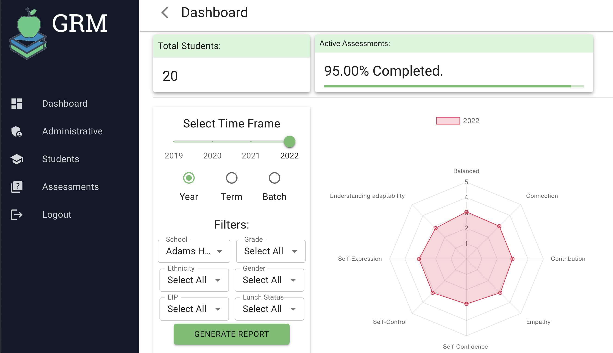
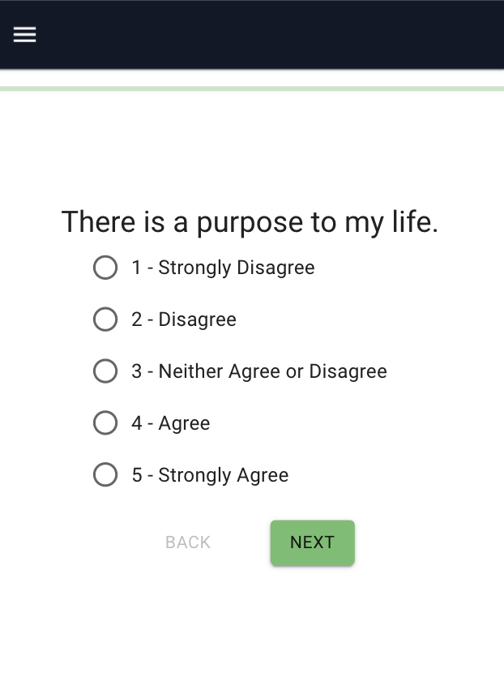

# Growth Resiliency Measure

_Duration: 2 Week Sprint_

Growth Resiliency Measure is a full stack web application designed to administer resiliency assessments to students and collect those results for analysis on an administrative level.

The assessments that GRM provides are 27 questions in length and scale from strongly agree to strongly disagree. GRM was looking for an application to provide students easy access to the assessments as this would help take the workload off teacher’s plates.

GRM believes that resiliency is a better indicator of life long success over grades. The areas that the assessment tracks form the acronym B-SUCCESS.
B-SUCCESS includes measures in balance, self-confidence, understanding, connection, contribution, empathy, self expression, and self control. 

The objective of the project was to create an easy and intuitive application for students to take the assessments, and for administrators to visualize the data collected from students.  The data visualizations can then be used to measure changes of the different measures of the B-Success method over time.  Admins can use this data to target specific needs of an entire school, or address individual students if they see concerning trends in measures.

## Prerequisites

Before you get started, make sure you have the following software installed on your computer:

- [Node.js](https://nodejs.org/en/)
- [PostrgeSQL](https://www.postgresql.org/)
- [Nodemon](https://nodemon.io/)
- [Postico](https://eggerapps.at/postico/)

## Create database and table

Please reference the databaseseed.sql file for database setup.

## Installation

- Clone repository to local machine.
- Run npm install in terminal to install all necessary dependencies.
- To setup the database locally, please see the databaseseed.sql file for instructions.

## Built With

><a href="https://developer.mozilla.org/en-US/docs/Web/CSS"></a><a href="https://developer.mozilla.org/en-US/docs/Web/HTML"></a><a href="https://developer.mozilla.org/en-US/docs/Web/JavaScript"></a><a href="https://material-ui.com/"></a><a href="https://nodejs.org/en/"></a><a href="https://www.postgresql.org/"></a><a href="https://reactjs.org/"></a><a href="https://redux.js.org/"></a>

- Javascript
- React
- Redux
- Sagas
- Node.js
- Express
- PostgreSQL
- Material UI
- HTML
- CSS
## Development Setup Instructions

- Run `npm install`
- Create a `.env` file at the root of the project and paste this line into the file:
  ```
  SERVER_SESSION_SECRET=superDuperSecret
  ```
  While you're in your new `.env` file, take the time to replace `superDuperSecret` with some long random string like `25POUbVtx6RKVNWszd9ERB9Bb6` to keep your application secure. Here's a site that can help you: [https://passwordsgenerator.net/](https://passwordsgenerator.net/). If you don't do this step, create a secret with less than eight characters, or leave it as `superDuperSecret`, you will get a warning.
- Start postgres if not running already by using `brew services start postgresql`
- Run `npm run server`
- Run `npm run client`
- Navigate to `localhost:3000`

## Screen Capture



## Authors

* [Brandon Lanier](https://github.com/brandon-lanier)
* [Benjamin Pedrick](https://github.com/benped)
* [Leah Atkins](https://github.com/Leah-Atkins84)
* [Adam Garberg](https://github.com/agarberg)
* [Kelsey Peterson](https://github.com/kelseypeterson1)

See also the list of [contributors](https://github.com/Leah-Atkins84/GRM/graphs/contributors) who participated in this project.
